[TOC]

# 一、knn

## 1、理论知识

### 1.1 KNN简介

k近邻法(k-nearest neighbor, k-NN)是1967年由Cover T和Hart P提出的一种基本分类与回归方法。它的工作原理是：存在一个样本数据集合，也称作为训练样本集，并且样本集中每个数据都存在标签，即我们知道样本集中每一个数据与所属分类的对应关系。输入没有标签的新数据后，将新的数据的每个特征与样本集中数据对应的特征进行比较，然后算法提取样本最相似数据(最近邻)的分类标签。一般来说，我们只选择样本数据集中前k个最相似的数据，这就是k-近邻算法中k的出处，通常k是不大于20的整数。最后，选择k个最相似数据中出现次数最多的分类，作为新数据的分类。

步骤：

1. 计算已知类别数据集中的点与当前点之间的距离；
2. 按照距离递增次序排序；
3. 选取与当前点距离最小的k个点；
4. 确定前k个点所在类别的出现频率；
5. 返回前k个点所出现频率最高的类别作为当前点的预测分类。

### 1.2 KNN优缺点 

**决策树的一些优点：**

- 易于理解和解释。决策树可以可视化。
- 几乎不需要数据预处理。其他方法经常需要数据标准化，创建虚拟变量和删除缺失值。决策树还不支持缺失值。
- 使用树的花费（例如预测数据）是训练数据点(data points)数量的对数。
- 可以同时处理数值变量和分类变量。其他方法大都适用于分析一种变量的集合。
- 可以处理多值输出变量问题。
- 使用白盒模型。如果一个情况被观察到，使用逻辑判断容易表示这种规则。相反，如果是黑盒模型（例如人工神经网络），结果会非常难解释。
- 即使对真实模型来说，假设无效的情况下，也可以较好的适用。

**决策树的一些缺点：**

- 决策树学习可能创建一个过于复杂的树，并不能很好的预测数据。也就是过拟合。修剪机制（现在不支持），设置一个叶子节点需要的最小样本数量，或者数的最大深度，可以避免过拟合。
- 决策树可能是不稳定的，因为即使非常小的变异，可能会产生一颗完全不同的树。这个问题通过decision trees with an ensemble来缓解。
- 概念难以学习，因为决策树没有很好的解释他们，例如，XOR, parity or multiplexer problems。
- 如果某些分类占优势，决策树将会创建一棵有偏差的树。因此，建议在训练之前，先抽样使样本均衡。

### 1.3 常用的向量距离度量准则

常用欧式距离

欧氏距离是最易于理解的一种距离计算方法，源自欧氏空间中两点间的距离公式.
欧式空间是一个非常专业的名词，对于我们编程来说，就等价理解成N维空间即可。

还有曼哈顿距离,切比雪夫距离,马氏距离,巴氏距离,汉明距离,皮尔逊系数,信息熵等方法

### 1.4 归一化数据的重要性 

以神经网络曲线拟合为例：

            (1-1)

为第个样本权重，为第个样本特征，设优化的每一时刻均为，如果特征样本不进行归一化或者说特征间差距较大，例如：

       (1-2)

则上述公式可以等效为：

               (1-3)

可以看出，所有样本的特征只剩下第2个特征起作用，必然会导致欠拟合问题。

### 1.5 sklearn.neighbors模块使用

KNneighborsClassifier重要参数说明

**(1) n_neighbors**：默认为5，就是k-NN的k的值，选取最近的k个点

**(2) weights**：默认是uniform，参数可以是uniform、distance，也可以是用户自己定义的函数。uniform是均等的权重，就说所有的邻近点的权重都是相等的。distance是不均等的权重，距离近的点比距离远的点的影响大。用户自定义的函数，接收距离的数组，返回一组维数相同的权重

# 二、决策树

## 1、理论知识 

### 1.1 决策树原理

决策树(decision tree)是一种基本的分类与回归方法。举个通俗易懂的例子，如下图所示的流程图就是一个决策树，长方形代表判断模块(decision block)，椭圆形成代表终止模块(terminating block)，表示已经得出结论，可以终止运行。从判断模块引出的左右箭头称作为分支(branch)，它可以达到另一个判断模块或者终止模块。我们还可以这样理解，分类决策树模型是一种描述对实例进行分类的树形结构。决策树由结点(node)和有向边(directed edge)组成。结点有两种类型：内部结点(internal node)和叶结点(leaf node)。内部结点表示一个特征或属性，叶结点表示一个类。如下图所示的决策树，长方形和椭圆形都是结点。长方形的结点属于内部结点，椭圆形的结点属于叶结点，从结点引出的左右箭头就是有向边。而最上面的结点就是决策树的根结点(root node)。这样，结点说法就与模块说法对应上了，理解就好。

适用场景：决策树能够生成清晰的基于特征(feature)选择不同预测结果的树状结构，希望更好的理解手上的数据的时候往往可以使用决策树，在实际应用中，受限于它的简单性，决策树更大的用处是作为一些更有用的算法的基石，例如随机森林。

### 1.2 决策树优缺点 

优点：

(1\) 计算复杂度不高，输出结果易于理解

以ID3为例，每次运算都是基于某一列特征，特征计算完后，下次计算不考虑该最优特征，并且通过适当剪支可以简化复杂度

\(2\) 对中间值的缺失不敏感

\(3\) 可以处理不相关特征数据

是基于每一列特征来计算，不考虑特征之间的依赖关系

缺点：

(1\) 决策树学习可能创建一个过于复杂的树，并不能很好的预测数据。也就是过拟合。修剪机制（现在不支持），设置一个叶子节点需要的最小样本数量，或者数的最大深度，可以避免过拟合。

\(2)决策树可能是不稳定的，因为即使非常小的变异，可能会产生一颗完全不同的树。这个问题通过decision trees with an ensemble来缓解。

\(3\)概念难以学习

### 1.3 决策树算法种类

(1\) ID3

以信息增益作为树的分裂准则，该算法存在的不足：

\(a\) ID3没有考虑连续特征，比如长度，密度都是连续值，无法在ID3运用，如果一定要运用ID3出来连续属性，那么要自己将连续特征离散化(办法非常多)

\(b\) 对于缺失值的情况没有做考虑

\(c\) 偏向于多值属性。例，如果存在唯一标识属性ID(每个样本的ID属性值都不相同)，则ID3会选择它作为优先分裂属性，这样虽然使得划分充分纯净，但这种划分对分类几乎毫无用处

\(2\) C4.5

(a)以基于信息增益的增益率（gain ratio）作为树的分裂准则，解决了ID3的偏向于多值属性问题

(b)内部自己考虑了连续属性离散化过程，所以克服了ID3的没有考虑连续特征问题

(c)内部考虑了缺失值的自动处理策略

\(3\) CART

ID3和C4.5只能处理分类问题，而CART可以处理分类和回归问题，CART考虑问题非常全面，有较多优点，可以自行深入研究

### 1.4选择根节点的指标

特征选择在于选取对训练数据具有分类能力的特征。这样可以提高决策树学习的效率，如果利用一个特征进行分类的结果与随机分类的结果没有很大差别，则称这个特征是没有分类能力的。经验上扔掉这样的特征对决策树学习的精度影响不大。通常特征选择的标准是信息增益和基尼系数

### 1.4.1 信息熵(香农熵)的深入理解

信息熵用于度量信息的混乱程度，信息越混乱说明能够包含的信息量越多，则熵越大，例如一个声波，我们可以通过傅里叶变换分析其频谱看到其中的大量的信息；信息越有序说明包含的信息量越少，则熵越小，例如一条直线，这个信息太少了，则它的熵也非常小。

通过上式，我们可以得到所有类别的信息。为了计算熵，我们需要计算所有类别所有可能值包含的信息期望值(数学期望)，通过下面的公式得到：

期中n是分类的数目。熵越大，随机变量的不确定性就越大。

我们定义贷款申请样本数据表中的数据为训练数据集D，则训练数据集D的经验熵为H(D)，|D|表示其样本容量，及样本个数。设有K个类Ck, = 1,2,3,...,K,|Ck|为属于类Ck的样本个数，因此经验熵公式就可以写为 ：

根据此公式计算经验熵H(D)，分析贷款申请样本数据表中的数据。最终分类结果只有两类，即放贷和不放贷。根据表中的数据统计可知，在15个数据中，9个数据的结果为放贷，6个数据的结果为不放贷。所以数据集D的经验熵H(D)为：

经过计算可知，数据集D的经验熵H(D)的值为0.971。

### 1.4.2 信息增益(互信息)的深入理解

信息增益是相对于特征而言的，信息增益越大，特征对最终的分类结果影响也就越大，我们就应该选择对最终分类结果影响最大的那个特征作为我们的分类特征。

在讲解信息增益定义之前，我们还需要明确一个概念，条件熵。

条件熵H(Y|X)表示在已知随机变量X的条件下随机变量Y的不确定性，随机变量X给定的条件下随机变量Y的条件熵(conditional entropy)H(Y|X)，定义为X给定条件下Y的条件概率分布的熵对X的数学期望：

这里，

同理，当条件熵中的概率由数据估计(特别是极大似然估计)得到时，所对应的条件熵称为条件经验熵(empirical conditional entropy)。

明确了条件熵和经验条件熵的概念。接下来，让我们说说信息增益。前面也提到了，信息增益是相对于特征而言的。所以，特征A对训练数据集D的信息增益g(D,A)，定义为集合D的经验熵H(D)与特征A给定条件下D的经验条件熵H(D|A)之差，即：

一般地，熵H(D)与条件熵H(D|A)之差称为互信息(mutual information)。决策树学习中的信息增益等价于训练数据集中类与特征的互信息。

设特征A有n个不同的取值{a1,a2,···,an}，根据特征A的取值将D划分为n个子集{D1,D2，···,Dn}，|Di|为Di的样本个数。记子集Di中属于Ck的样本的集合为Dik，即Dik = Di ∩ Ck，|Dik|为Dik的样本个数。于是经验条件熵的公式可以些为：

以贷款申请样本数据表为例进行说明。看下年龄这一列的数据，也就是特征A1，一共有三个类别，分别是：青年、中年和老年。我们只看年龄是青年的数据，年龄是青年的数据一共有5个，所以年龄是青年的数据在训练数据集出现的概率是十五分之五，也就是三分之一。同理，年龄是中年和老年的数据在训练数据集出现的概率也都是三分之一。现在我们只看年龄是青年的数据的最终得到贷款的概率为五分之二，因为在五个数据中，只有两个数据显示拿到了最终的贷款，同理，年龄是中年和老年的数据最终得到贷款的概率分别为五分之三、五分之四。所以计算年龄的信息增益，过程如下：

同理，计算其余特征的信息增益g(D,A2)、g(D,A3)和g(D,A4)。分别为：

最后，比较特征的信息增益，由于特征A3(有自己的房子)的信息增益值最大，所以选择A3作为最优特征。

1.4.3gini系数

gini系数与ent的区别：

1. 信息增益和基尼指数不是等价的
2. 大多数时候它们的区别很小
3. **信息增益对较混乱的集合有很好的表现力，但是基尼指数有所欠缺。另一方面，这也说明较纯的集合，基尼指数可能会区分得更清楚**
4. gini系数越小越好，ent越大越好

https://blog.csdn.net/qq_39408570/article/details/89764177

### 1.6 sklearn中tree模块使用

重要参数分析：

\(1\) criterion：特征选择标准，可选参数，默认是gini(CART)，可以设置为entropy(ID3)

\(2\) 特征划分点选择标准splitter：主要考虑计算量

\(3\) 划分时考虑的最大特征数、决策树最大深、内部节点再划分所需最小样本数、叶子节点最少样本数、叶子节点最小的样本权重和、最大叶子节点数、节点划分最小不纯度：这些策略都是为了防止过拟合

\(4\) 类别权重:主要是克服样本不平衡问题

https://scikit-learn.org/stable/modules/generated/sklearn.tree.DecisionTreeClassifier.html

## 2、代码分析

### 2.1 递归算法理解 

递归算法中，有两个固定步骤：递归头和递归体，缺一不可。

> \(1\) 递归头：什么时候不调用自己的方法，即递归的结束条件
>
> \(2\) 递归体：什么时候需要调用自己的方法，即自己调用自己

递归算法的优点：将问题逐渐简单化；

缺点：会占用大量的系统堆栈，内存耗用多，递归调用层数多时，比循环慢很多。

### 2.2 树的递归划分举例

假设第i列是最优特征，使用该特征作为根节点，进行递归，则原来的dataSet，会变成两个子dataSet,然后对这两个子dataSet分别进行递归创建树,直到满足结束条件

由于特征A3(有自己的房子)的信息增益值最大，所以选择特征A3作为根结点的特征。它将训练集D划分为两个子集D1(A3取值为"是")和D2(A3取值为"否")。由于D1只有同一类的样本点，所以它成为一个叶结点，结点的类标记为“是”。

对D2则需要从特征A1(年龄)，A2(有工作)和A4(信贷情况)中选择新的特征，计算各个特征的信息增益：

根据计算，选择信息增益最大的特征A2(有工作)作为结点的特征。由于A2有两个可能取值，从这一结点引出两个子结点：一个对应"是"(有工作)的子结点，包含3个样本，它们属于同一类，所以这是一个叶结点，类标记为"是"；另一个是对应"否"(无工作)的子结点，包含6个样本，它们也属于同一类，所以这也是一个叶结点，类标记为"否"。

这样就生成了一个决策树，该决策树只用了两个特征(有两个内部结点)，生成的决策树如下图所示。

# 三.朴素贝叶斯

## 1、理论知识

### 1.1条件概率、先验概率和后验概率的含义和计算

公式：

**我们把P(A)称为"先验概率"**，即在B事件发生之前，我们对A事件概率的一个判断。

**P(A|B)称为"后验概率"**，即在B事件发生之后，我们对A事件概率的重新评估。

**P(B|A)/P(B)称为"可能性函数"**，这是一个调整因子，使得预估概率更接近真实概率。

 后验概率　＝　先验概率 ｘ 调整因子

基于概率，通过某对象的先验概率，利用贝叶斯公式计算出其后验概率，即该对象属于某一类的概率，选择具有最大后验概率的类作为该对象所属的类。

### 1.2 贝叶斯定理分类思想

例子：

现在又来了第七个病人，是一个打喷嚏的建筑工人。请问他患上感冒的概率有多大？

根据贝叶斯定理：

可得：

根据朴素贝叶斯条件独立性的假设可知，"打喷嚏"和"建筑工人"这两个特征是独立的，因此，上面的等式就变成了

这里可以计算：

因此，这个打喷嚏的建筑工人，有66%的概率是得了感冒。同理，可以计算这个病人患上过敏或脑震荡的概率。比较这几个概率，就可以知道他最可能得什么病。

这就是贝叶斯分类器的基本方法：在统计资料的基础上，依据某些特征，计算各个类别的概率，从而实现分类。

**同样，在编程的时候，如果不需要求出所属类别的具体概率，P(打喷嚏) = 0.5和P(建筑工人) = 0.33的概率是可以不用求的。**

### 1.3 贝叶斯分类方法种类

朴素贝叶斯: 各特征间独立，直接计算条件概率进行分类，是最简单的一种贝叶斯分类算法。

贝叶斯网络: 各特征独立这个条件在实际应用中通常难以满足，此时需要使用贝叶斯网络进行分类。贝叶斯网络也称为信念网络，或有向无环图模型，是一种概率图模型。

### 1.4 贝叶斯分类典型应用

垃圾邮件过滤

文本情感分类：电影评论

论坛真实账号监测

浏览器输入自动提示

### 1.5 朴素贝叶斯优缺点

优点：可以处理小样本情况，可以处理多分类问题

缺点：对于输入数据比较敏感

### 1.6 朴素贝叶斯的三种实现

**(1)** **基于伯努利模型实现，即先验为伯努利分布的朴素贝叶斯**

伯努利模型中，对于一个样本来说，其特征用的是全局的特征，在伯努利模型中，**每个特征的取值是布尔型的，即true和false，或者1和0**。在文本分类中，就是一个特征有没有在一个文档中出现，而不考虑其出现的次数。在文本里面对应的就是**词集模型: 单词构成的集合**，集合自然每个元素都只有一个，也即词集中的每个单词都只有一个。

**(2)** **基于多项式模型实现，即先验为多项式分布的朴素贝叶斯**

该模型常用于文本分类，特征是单词，取值是单词的出现次数，对应的就是**词袋模型：如果一个单词在文档中出现不止一次，并统计其出现的次数（频数）**。是在自然语言处理和信息检索中的一种简单假设。在这种模型中，文本（段落或者文档）被看作是无序的词汇集合，忽略语法甚至是单词的顺序。

**(3)** **基于高斯模型实现，即先验为高斯分布的朴素贝叶斯**

当特征是**连续变量**的时候，运用多项式模型就会导致很多条件概率为0，此时即使做平滑，所得到的条件概率也难以描述真实情况，存在较大偏差，在处理连续的特征变量，应采用高斯模型。连续变量高斯离散化计算过程是：利用样本的特征列计算出均值和方差，然后构造概率密度函数，将每个具体样本值代入到密度函数中，得到概率值，该概率值可以反映各个值的相对可能性。

在不同的先验条件下，为了得到更好的分类效果，需要采用不同的朴素贝叶斯实现方法。而先验的分布估计需要依据输入特征数据来确定，例如文本分类中，如果你将文档转换为词向量的过程采用的是词集模型，那么你应该使用基于伯努利模型实现的朴素贝叶斯方法，其他同理。

### 1.7 朴素贝叶斯的改进

(1) 拉普拉斯平滑：防止由于某一个条件概率为0，导致分类概率为0的不合理情形

(2) 条件概率对数化：防止小数相乘出现的下溢出问题

### 1.8 sklearn.beys模块

https://scikit-learn.org/dev/modules/generated/sklearn.naive_bayes.MultinomialNB.html

## 2、代码分析

### 2.1 一个细节

在朴素贝叶斯分类算法中，有两类特征会降低模型的精度：

第一种：只出现过几次，这样的特征会导致过拟合。因为模型没有更多的信息来精确的确定这个特征是否重要，因为它就只出现了几次。并且它们在训练集和测试集中对于目标变量的影响也会有很大的差异，因为出现太少，因此属性分布不平衡。

第二种：出现的次数太多，比如像and和to这样的特征根本不能给模型带来任何有意义的信息，这些词被称为停顿词，应当剔除掉。

### 2.2 代码计算过程

#### (1) 词汇表-每次运算顺序都不一样

set（）每次运算顺序不同

#### (2) 条件概率

P(侮辱类|stupid,garbage)=P(stupid|侮辱类)xP(garbage|侮辱类)xP(侮辱类)/P(stupid,garbage)

P(非侮辱类|stupid,garbage)=P(stupid|非侮辱类)xP(garbage|非侮辱类)xP(非侮辱类)/P(stupid,garbage)

由于是比较上述两个值得大小，故不需要计算分母P(stupid,garbage)值

P(stupid|侮辱类)计算：首先找出所有的侮辱类样本，构造子空间，然后在该子空间中计算stupid单词出现的概率即可。

# 四、逻辑回归

## 1.理论知识

### 1.1 回归的含义

回归即为最佳拟合，用一条直线对这些点进行拟合的过程，逻辑回归过程即为寻找最佳拟合参数的过程，使用的是最优化理论。

### 1.2 逻辑回归思想

逻辑回归是一种广义的线性回归模型，主要用于解决二分类问题。所谓二分类问题，就是比如判断一个邮件是否是垃圾邮件、根据某些特征判断肿瘤是否为恶性肿瘤等问题，我们可以将是/否表示为1/0。

当对二分类问题进行回归分析时，采用传统的线性回归函数进行拟合并不是一个好的方案。于是我们将使用另一种函数——**Sigmoid函数**

Sigmoid函数表达式：

函数图像：

**现在使用sigmoid函数拟合上面的例子，当****时，我们认为它属于种类1**

上面提到，我们使用sigmoid函数进行预测时，当，我们认为是种类1，当0.gif)时，我们认为是种类0。那么，什么时候等于0.5呢？观察sigmoid函数的图像，当z等于0时， %3D 0.gif)。所以我们令,决策边界

决策边界图像为：

可以看到决策边界将两个不同的种类分开了。

又比如，为更复杂的多项式时，可以画出以下图像：

### 1.3损失函数

线性回归中，我们使用平方误差作为我们的代价函数（损失函数）：

其中，(i)为样例序号。

那时,平方误差代价函数可以平滑下降直到一个最低点。

下图是一元一次线性方程回归的代价函数图像：

但是逻辑回归的函数为。

如果再使用平方误差作为代价函数，它的图像将会是凹凸不平的：

 这意味着梯度下降算法很可能无法找到最低点，会卡在某个极小值点。

 为了解决这个问题，我们将使用另一种模型作为我们的代价函数：

**对数损失函数**
使用对数损失函数作为逻辑回归的损失函数是由极大似然估计推导所得

单个样例损失：

其中，

当真实值为1时，图像为：

可以看出，在真实值y为1的情况下：当预测值接近1时，计算出的损失很小；而当接近0时，计算出的损失很大很大。

同理，当真实值为0时，图像为：

 在真实值y为0的情况下：当预测值接近0时，计算出的损失很小；而当接近0时，计算出的损失很大很大。

化简,

上式求和即可得：

公式：

让我们用这个新的代价函数模拟一下最开始左图的代价函数模型：

 现在这个图像很适合使用梯度下降算法来找到它的最低点。

### 1.4 最优化理论中常用的优化算法

#### 1.4.1 梯度下降法和梯度上升法

梯度下降可以理解为你站在山的某处，想要下山，此时最快的下山方式就是你环顾四周，哪里最陡峭，朝哪里下山，一直执行这个策略，在第N个循环后，你就到达了山的最低处

如上图，假如为山的纵切面，那每次下山一小步，经过N次后你便可以到达山底。

对于3维图像，也存在类似步骤，使得在N步之后到达山脚下。

**微分**
单变量函数中，梯度代表的是图像斜率的变化

多变量函数中，梯度代表的是向量，变化最快的地方，即最陡峭的方向

**步长（学习率）  a** 

下山的步子。步子太大容易扯着蛋，步子太小下山太慢，可能下山都太阳落山了，因此需要确定一个步长a ，使得经过合适的步子后能够顺利最快的下山。确定某个值，使得迭代到某次后判断与设定值的大小，若小于则停止循环。
不同步长的比较
小步长
小步长表现为计算量大，耗时长，但比较精准。

大步长
大步长，即较大的a，表现为震荡，容易错过最低点，计算量相对较小。

注意：由于函数凹凸性，对于凸函数能够无限逼近其最优解，对于非凸函数，只能获取局部最优解

**两个问题：震荡和梯度爆炸**

https://blog.csdn.net/weixin_60737527/article/details/123762695

#### 1.4.2 随机梯度下降法

#### 1.4.3 批量梯度下降法

#### 1.4.4 小批量随机梯度下降法

蓝色是批量下降，紫色是随机下降，绿色是小批量下降

### 1.5 多分类问题的两种实现

**(1) one vs one** **一对一**

假设有n个类别，则会针对两两类别建立二项分类器，得到k=n*(n-1)/2个分类器。对新数据进行分类时，依次使用这k个分类器进行分类，每次分类相当于一次投票，分类结果是哪个就相当于对哪个类投了一票。在使用全部k个分类器进行分类后，相当于进行了k次投票，选择得票最多的那个类作为最终分类结果。训练次数非常多，占用空间很大。

**(2) one vs many** **一对多**

假设有n个类别，那么就会建立n个二分类器，每个分类器针对其中一个类别和剩余类别进行分类。进行预测时，利用这n个二分类器进行分类，得到数据属于当前类的概率，选择其中概率最大的一个类别作为最终的预测结果。当种类多的时候，分类效果相对略差。

### 1.6 正则化

### 1.7Logistic回归的优缺点

优点：
（1）训练速度较快，分类的时候，计算量仅仅只和特征的数目相关；
（2）简单易理解，模型的可解释性非常好，从特征的权重可以看到不同的特征对最后结果的影响；
（3）适合二分类问题，不需要缩放输入特征；
（4）内存资源占用小，因为只需要存储各个维度的特征值；

缺点：
（1）不能用Logistic回归去解决非线性问题，因为Logistic的决策线性的；
（2）对多重共线性数据较为敏感；
（3）很难处理数据不平衡的问题；
（4）准确率并不是很高，因为形式非常的简单(非常类似线性模型)，很难去拟合数据的真实分布；
（5）逻辑回归本身无法筛选特征，有时会用gbdt(一种基于决策树的集成算法)来筛选特征，然后再上逻辑回归

### 1.8sklearn.learn_model.LogisticRegression

- **penalty：**惩罚项，str类型，可选参数为l1和l2，默认为l2。用于指定惩罚项中使用的规范。newton-cg、sag和lbfgs求解算法只支持L2规范。L1G规范假设的是模型的参数满足拉普拉斯分布，L2假设的模型参数满足高斯分布，所谓的范式就是加上对参数的约束，使得模型更不会过拟合，但是如果要说是不是加了约束就会好，这个没有人能回答，只能说，加约束的情况下，理论上应该可以获得泛化能力更强的结果。

- **dual：**对偶或原始方法，bool类型，默认为False。对偶方法只用在求解线性多核(liblinear)的L2惩罚项上。当样本数量>样本特征的时候，dual通常设置为False。

- **tol：**停止求解的标准，float类型，默认为1e-4。就是求解到多少的时候，停止，认为已经求出最优解。

- **c：**正则化系数λ的倒数，float类型，默认为1.0。必须是正浮点型数。像SVM一样，越小的数值表示越强的正则化。

- **fit_intercept：**是否存在截距或偏差，bool类型，默认为True。

- **class_weight：**用于标示分类模型中各种类型的权重，可以是一个字典或者'balanced'字符串，默认为不输入，也就是不考虑权重，即为None。如果选择输入的话，可以选择balanced让类库自己计算类型权重，或者自己输入各个类型的权重。举个例子，比如对于0,1的二元模型，我们可以定义class_weight={0:0.9,1:0.1}，这样类型0的权重为90%，而类型1的权重为10%。如果class_weight选择balanced，那么类库会根据训练样本量来计算权重。某种类型样本量越多，则权重越低，样本量越少，则权重越高。当class_weight为balanced时，类权重计算方法如下：n_samples / (n_classes * np.bincount(y))。n_samples为样本数，n_classes为类别数量，np.bincount(y)会输出每个类的样本数，例如y=[1,0,0,1,1],则np.bincount(y)=[2,3]。

- **solver**：

  优化算法选择参数，只有五个可选参数，即newton-cg,lbfgs,liblinear,sag,saga。默认为liblinear。solver参数决定了我们对逻辑回归损失函数的优化方法，有四种算法可以选择，分别是：

  - **liblinear：**使用了开源的liblinear库实现，内部使用了坐标轴下降法来迭代优化损失函数。
  - **lbfgs：**拟牛顿法的一种，利用损失函数二阶导数矩阵即海森矩阵来迭代优化损失函数。
  - **newton-cg：**也是牛顿法家族的一种，利用损失函数二阶导数矩阵即海森矩阵来迭代优化损失函数。
  - **sag：**即随机平均梯度下降，是梯度下降法的变种，和普通梯度下降法的区别是每次迭代仅仅用一部分的样本来计算梯度，适合于样本数据多的时候。
  - **saga：**线性收敛的随机优化算法的的变重。
  - 总结：
    - liblinear适用于小数据集，而sag和saga适用于大数据集因为速度更快。
    - 对于多分类问题，只有newton-cg,sag,saga和lbfgs能够处理多项损失，而liblinear受限于一对剩余(OvR)。啥意思，就是用liblinear的时候，如果是多分类问题，得先把一种类别作为一个类别，剩余的所有类别作为另外一个类别。一次类推，遍历所有类别，进行分类。
    - newton-cg,sag和lbfgs这三种优化算法时都需要损失函数的一阶或者二阶连续导数，因此不能用于没有连续导数的L1正则化，只能用于L2正则化。而liblinear和saga通吃L1正则化和L2正则化。
    - 同时，sag每次仅仅使用了部分样本进行梯度迭代，所以当样本量少的时候不要选择它，而如果样本量非常大，比如大于10万，sag是第一选择。但是sag不能用于L1正则化，所以当你有大量的样本，又需要L1正则化的话就要自己做取舍了。要么通过对样本采样来降低样本量，要么回到L2正则化。
    - 从上面的描述，大家可能觉得，既然newton-cg, lbfgs和sag这么多限制，如果不是大样本，我们选择liblinear不就行了嘛！错，因为liblinear也有自己的弱点！我们知道，逻辑回归有二元逻辑回归和多元逻辑回归。对于多元逻辑回归常见的有one-vs-rest(OvR)和many-vs-many(MvM)两种。而MvM一般比OvR分类相对准确一些。郁闷的是liblinear只支持OvR，不支持MvM，这样如果我们需要相对精确的多元逻辑回归时，就不能选择liblinear了。也意味着如果我们需要相对精确的多元逻辑回归不能使用L1正则化了。

- **max_iter：**算法收敛最大迭代次数，int类型，默认为10。仅在正则化优化算法为newton-cg, sag和lbfgs才有用，算法收敛的最大迭代次数。

## 2.代码分析

### 2.1数据处理

数据中的缺失值是一个非常棘手的问题，很多文献都致力于解决这个问题。那么，数据缺失究竟带来了什么问题？假设有100个样本和20个特征，这些数据都是机器收集回来的。若机器上的某个传感器损坏导致一个特征无效时该怎么办？它们是否还可用？答案是肯定的。因为有时候数据相当昂贵，扔掉和重新获取都是不可取的，所以必须采用一些方法来解决这个问题。下面给出了一些可选的做法：

- 使用可用特征的均值来填补缺失值；
- 使用特殊值来填补缺失值，如-1；
- 忽略有缺失值的样本；
- 使用相似样本的均值添补缺失值；
- 使用另外的机器学习算法预测缺失值。

预处理数据做两件事：

- 如果数据集中一条数据的特征值已经缺失，那么我们选择实数0来替换所有缺失值，因为本文使用Logistic回归。因此这样做不会影响回归系数的值。sigmoid(0)=0.5，即它对结果的预测不具有任何倾向性。
- 如果数据集中一条数据的类别标签已经缺失，那么我们将该类别数据丢弃，因为类别标签与特征不同，很难确定采用某个合适的值来替换。

# 五、svm

## 1.理论知识

### 1.1算法实质

SVM的英文全称是Support Vector Machines，我们叫它支持向量机。支持向量机是我们用于分类的一种算法。

在很久以前的情人节，一位大侠要去救他的爱人，但天空中的魔鬼和他玩了一个游戏。

魔鬼在桌子上似乎有规律放了两种颜色的球，说："你用一根棍分开它们？要求：尽量在放更多球之后，仍然适用。"

于是大侠这样放，干的不错？

然后魔鬼，又在桌上放了更多的球，似乎有一个球站错了阵营。显然，大侠需要对棍做出调整。

**SVM就是试图把棍放在最佳位置，好让在棍的两边有尽可能大的间隙。这个间隙就是球到棍的距离。**

现在好了，即使魔鬼放了更多的球，棍仍然是一个好的分界线。

魔鬼看到大侠已经学会了一个trick(方法、招式)，于是魔鬼给了大侠一个新的挑战。

现在，大侠没有棍可以很好帮他分开两种球了，现在怎么办呢？当然像所有武侠片中一样大侠桌子一拍，球飞到空中。然后，凭借大侠的轻功，大侠抓起一张纸，插到了两种球的中间。

现在，从空中的魔鬼的角度看这些球，这些球看起来像是被一条曲线分开了。

把这些球叫做**data**，把棍子叫做**classifier**, 找到最大间隙的**trick**叫做**optimization**，拍桌子叫做**kernelling,** 那张纸叫做**hyperplane**。

### 1.2 直观理解

从逻辑回归优化函数开始

更改代价函数

人们有时将支持向量机看作是大间距分类器

------

当你使用大间距分类器的时候，你的学习算法会受异常点(outlier) 的影响。比如我们加入一个额外的正样本。

​                               

在这里，如果你加了这个样本，为了将样本用最大间距分开，也许我最终会得到一条类似这样的决策界，粉色的线，仅仅基于一个异常值，仅仅基于一个样本，就将我的决策界从这条黑线变到这条粉线，这实在是不明智的。而如果正则化参数c  ，设置的非常大，这事实上正是支持向量机将会做的。它将决策界从黑线变到了粉线。如果你将c设置的不要太大，则你最终会得到这条黑线。当c不是非常非常大的时候，它可以忽略掉一些异常点的影响，得到更好的决策界。甚至当你的数据不是线性可分的时候，支持向量机也可以给出好的结果。

### 1.3数学推导

数学基础

目标函数

我接下来忽略掉截距。特征数置为2，因此我们仅有两个特征，现在我们来看一下目标函数，支持向量机的优化目标函数。当我们仅有两个特征，这个式子可以写作：  ，                               

### 1.4核函数Kernels

尽管你不去写你自己的**SVM**的优化软件，但是你也需要做几件事：

1、是提出参数的选择。

2、需要选择内核参数或你想要使用的相似函数，其中一个选择是：我们选择不需要任何内核参数，没有内核参数的理念，也叫线性核函数。因此，如果使用了线性核的**SVM**，这就意味不带有核函数的**SVM**。

从逻辑回归模型，我们得到了支持向量机模型，在两者之间，我们应该如何选择呢？

**下面是一些普遍使用的准则：**

  n为特征数，  m为训练样本数。

(1)如果相较于 m 而言，  n要大许多，即训练集数据量不够支持我们训练一个复杂的非线性模型，我们选用逻辑回归模型或者不带核函数的支持向量机。

(2)如果n  较小，而且  m大小中等，例如n  在 1-1000 之间，而 m 在10-10000之间，使用高斯核函数的支持向量机。

(3)如果  n较小，而  m较大，例如 n 在1-1000之间，而 m 大于50000，则使用支持向量机会非常慢，解决方案是创造、增加更多的特征，然后使用逻辑回归或不带核函数的支持向量机。

值得一提的是，神经网络在以上三种情况下都可能会有较好的表现，但是训练神经网络可能非常慢，选择支持向量机的原因主要在于它的代价函数是凸函数，不存在局部最小值。

### 1.4svm的优缺点

**优点**

- 可用于线性/非线性分类，也可以用于回归，泛化错误率低，也就是说具有良好的学习能力，且学到的结果具有很好的推广性。
- 可以解决小样本情况下的机器学习问题，可以解决高维问题，可以避免神经网络结构选择和局部极小点问题。
- SVM是最好的现成的分类器，现成是指不加修改可直接使用。并且能够得到较低的错误率，SVM可以对训练集之外的数据点做很好的分类决策。

**缺点**

- 对参数调节和和函数的选择敏感。

### 1.5sklearn.svm.SVC

sklearn.svm模块提供了很多模型供我们使用，我使用的是svm.SVC，它是基于libsvm实现的。

- **C**：惩罚项，float类型，可选参数，默认为1.0，C越大，即对分错样本的惩罚程度越大，因此在训练样本中准确率越高，但是泛化能力降低，也就是对测试数据的分类准确率降低。相反，减小C的话，容许训练样本中有一些误分类错误样本，泛化能力强。对于训练样本带有噪声的情况，一般采用后者，把训练样本集中错误分类的样本作为噪声。

- kernel：核函数类型，str类型，默认为'rbf'。可选参数为：

  - 'linear'：线性核函数
  - 'poly'：多项式核函数
  - 'rbf'：径像核函数/高斯核
  - 'sigmod'：sigmod核函数
  - 'precomputed'：核矩阵
  - precomputed表示自己提前计算好核函数矩阵，这时候算法内部就不再用核函数去计算核矩阵，而是直接用你给的核矩阵，核矩阵需要为n*n的。
  
- **tol**：svm停止训练的误差精度，float类型，可选参数，默认为1e^-3。

- **cache_size**：内存大小，float类型，可选参数，默认为200。指定训练所需要的内存，以MB为单位，默认为200MB。

- **class_weight**：类别权重，dict类型或str类型，可选参数，默认为None。给每个类别分别设置不同的惩罚参数C，如果没有给，则会给所有类别都给C=1，即前面参数指出的参数C。如果给定参数'balance'，则使用y的值自动调整与输入数据中的类频率成反比的权重。

- **max_iter**：最大迭代次数，int类型，默认为-1，表示不限制。

## 2.代码分析

本章未作模型代码

(1) 数学要求较高。SVM算法思想比较简单，难点是SVM求解问题，该问题涉及到比较难的数学(KKT条件，拉格朗日对偶、二次规划等)

https://cuijiahua.com/blog/2017/11/ml_8_svm_1.html

(2) 容易使用。SVM算法特别容易训练，需要考虑的参数很少，即使参数设置的不是非常合理，模型也还可以

(3) 神经网络是未来。SVM在5~10年前非常流行，原因是其可以对付小样本问题，然而如今是大数据时代，SVM难以训练，存在较大弊端，故而神经网络才是未来

# 六、AdaBoost

## 1.算法介绍

​	集成方法（ensemble method）通过组合多个学习器来完成学习任务，颇有点“三个臭皮匠顶个诸葛亮”的意味。基分类器一般采用的是弱可学习（weakly learnable）分类器，通过集成方法，组合成一个强可学习（strongly learnable）分类器。所谓弱可学习，是指学习的正确率仅略优于随机猜测的多项式学习算法；强可学习指正确率较高的多项式学习算法。集成学习的泛化能力一般比单一的基分类器要好，这是因为大部分基分类器都分类错误的概率远低于单一基分类器的。

集成方法主要包括Bagging和Boosting两种方法，Bagging和Boosting都是将已有的分类或回归算法通过一定方式组合起来，形成一个性能更加强大的分类器，更准确的说这是一种分类算法的组装方法，即将弱分类器组装成强分类器的方法。

## 2.算法分类

### 2.1 Bagging（袋装法）

自举汇聚法（bootstrap aggregating），也称为bagging方法。Bagging对训练数据采用自举采样（boostrap sampling），即有放回地采样数据，主要思想：

- 从原始样本集中抽取训练集。每轮从原始样本集中使用Bootstraping的方法抽取n个训练样本（在训练集中，有些样本可能被多次抽取到，而有些样本可能一次都没有被抽中）。共进行k轮抽取，得到k个训练集。（k个训练集之间是相互独立的）
- 每次使用一个训练集得到一个模型，k个训练集共得到k个模型。（注：这里并没有具体的分类算法或回归方法，我们可以根据具体问题采用不同的分类或回归方法，如决策树、感知器等）
- 对分类问题：将上步得到的k个模型采用投票的方式得到分类结果；对回归问题，计算上述模型的均值作为最后的结果。（所有模型的重要性相同）

### 2.2 Boosting（提升算法）

Boosting是一种与Bagging很类似的技术。Boosting的思路则是采用重赋权（re-weighting）法迭代地训练基分类器，主要思想：

- 每一轮的训练数据样本赋予一个权重，并且每一轮样本的权值分布依赖上一轮的分类结果。
- 基分类器之间采用序列式的线性加权方式进行组合。

### 2.3 Bagging、Boosting二者之间的区别

**样本选择上：**

- Bagging：训练集是在原始集中有放回选取的，从原始集中选出的各轮训练集之间是独立的。
- Boosting：每一轮的训练集不变，只是训练集中每个样例在分类器中的权重发生变化。而权值是根据上一轮的分类结果进行调整。

**样例权重：**

- Bagging：使用均匀取样，每个样例的权重相等。
- Boosting：根据错误率不断调整样例的权值，错误率越大则权重越大。

**预测函数：**

- Bagging：所有预测函数的权重相等。
- Boosting：每个弱分类器都有相应的权重，对于分类误差小的分类器会有更大的权重。

**并行计算：**

- Bagging：各个预测函数可以并行生成。
- Boosting：各个预测函数只能顺序生成，因为后一个模型参数需要前一轮模型的结果。

### 2.4 总结

这两种方法都是把若干个分类器整合为一个分类器的方法，只是整合的方式不一样，最终得到不一样的效果，将不同的分类算法套入到此类算法框架中一定程度上会提高了原单一分类器的分类效果，但是也增大了计算量。

下面是将决策树与这些算法框架进行结合所得到的新的算法：

- Bagging + 决策树 = 随机森林
- AdaBoost + 决策树 = 提升树
- Gradient Boosting + 决策树 = GBDT

**集成方法众多，Boosting方法中的一种最流行的版本，即AdaBoost。**

## 3.AdaBoost详解

### 3.1、计算样本权重

训练数据中的每个样本，赋予其权重，即样本权重，用向量D表示，这些权重都初始化成相等值。假设有n个样本的训练集：

设定每个样本的权重都是相等的，即1/n。

### 3.2、计算错误率

利用第一个弱学习算法h1对其进行学习，学习完成后进行错误率ε的统计：

### 3.3、计算弱学习算法权重

弱学习算法也有一个权重，用向量α表示，利用错误率计算权重α：

### 3.4、更新样本权重

在第一次学习完成后，需要重新调整样本的权重，以使得在第一分类中被错分的样本的权重，在接下来的学习中可以重点对其进行学习：

其中，ht(xi) = yi表示对第i个样本训练正确，不等于则表示分类错误。Zt是一个归一化因子：

这个公式我们可以继续化简，将两个公式进行合并，化简如下：

### 3.5、AdaBoost算法

重复进行学习，这样经过t轮的学习后，就会得到t个弱学习算法、权重、弱分类器的输出以及最终的AdaBoost算法的输出，分别如下：

其中，sign(x)是符号函数。具体过程如下所示：

**AdaBoost算法总结如下：**

## 4.AdaBoost算法优点和缺点

优点：泛化错误率低，易编码，可以应用在大部分分类器上，无参数调整

缺点：对离群点敏感

由于AdaBoost是boosting的改进方法，而且性能比较稳定，故而在实际中一般都直接使用AdaBoost而不会使用原始的boosting。

## 5. PR曲线、ROC和AUC计算

真正率TPR(真阳率): 所有正类样本中，预测为正类的概率，即对正类预测正确

假正率FPR(假阳率)：所有负类样本中，预测为正类的概率，即对正类预测错误

ROC曲线实例讲解：

假设预测样本为20个，预测为正类的概率已经进行了排序

1 2 3 4 5 6 7 8 9 10 11 12 13 14 15 16 17 18 19 20

(1) 在所排序的样本最左边，画一条线即  无 | 1 2 3 4 5 …，线左边的认为是正类，右边认为是负类，可以算出，TP(实际为正，预测为正)=0，FN(实际为正，预测为负)=10，TN(实际为负，预测为负)=10，FP(实际为负，预测为正)=0，故而FPR=0,TPR=0

(2) 在第一个样本后面，画一条线即 1 | 2 3 4 …，线左边的认为是正类，右边认为是负类，可以算出，TP(实际为正，预测为正)=1，FN(实际为正，预测为负)=9，TN(实际为负，预测为负)=10，FP(实际为负，预测为正)=0，故而FPR=0,TPR=0.1

(3) 在第二个样本后面，画一条线即 1 2| 3 4 …，线左边的认为是正类，右边认为是负类，可以算出，TP(实际为正，预测为正)=2，FN(实际为正，预测为负)=8，TN(实际为负，预测为负)=10，FP(实际为负，预测为正)=0，故而FPR=0,TPR=0.2

(4) 在第三个样本后面，画一条线即 1 2 3| 4 5…，线左边的认为是正类，右边认为是负类，可以算出，TP(实际为正，预测为正)=2，FN(实际为正，预测为负)=8，TN(实际为负，预测为负)=10，FP(实际为负，预测为正)=1，故而FPR=0.1,TPR=0.2

依次类推即可得到ROC曲线，总结如下：

**按照预测为正类的概率值由大到小排序，首先起点一定是(0,0)**，然后使用上述划线法进行计算，每次碰到一个预测为正的样本，则在Y方向加一个Y步长，否则在X方向加一个X步长，其中X和Y的步长，计算方法为X: **负类样本个数分之1，Y：正类样本个数分之1，如果是降序排列，则是减一个对应方向的步长即可**。

## 6.sklearn.ensemble.AdaBoost

- **base_estimator：**可选参数，默认为DecisionTreeClassifier。理论上可以选择任何一个分类或者回归学习器，不过需要支持样本权重。我们常用的一般是CART决策树或者神经网络MLP。默认是决策树，即AdaBoostClassifier默认使用CART分类树DecisionTreeClassifier，而AdaBoostRegressor默认使用CART回归树DecisionTreeRegressor。另外有一个要注意的点是，如果我们选择的AdaBoostClassifier算法是SAMME.R，则我们的弱分类学习器还需要支持概率预测，也就是在scikit-learn中弱分类学习器对应的预测方法除了predict还需要有predict_proba。
- **algorithm：**可选参数，默认为SAMME.R。scikit-learn实现了两种Adaboost分类算法，SAMME和SAMME.R。两者的主要区别是弱学习器权重的度量，SAMME使用对样本集分类效果作为弱学习器权重，而SAMME.R使用了对样本集分类的预测概率大小来作为弱学习器权重。由于SAMME.R使用了概率度量的连续值，迭代一般比SAMME快，因此AdaBoostClassifier的默认算法algorithm的值也是SAMME.R。我们一般使用默认的SAMME.R就够了，但是要注意的是使用了SAMME.R， 则弱分类学习器参数base_estimator必须限制使用支持概率预测的分类器。SAMME算法则没有这个限制。
- **n_estimators：**整数型，可选参数，默认为50。弱学习器的最大迭代次数，或者说最大的弱学习器的个数。一般来说n_estimators太小，容易欠拟合，_estimators太大，又容易过拟合，一般选择一个适中的数值。默认是50。在实际调参的过程中，我们常常将n_estimators和下面介绍的参数learning_rate一起考虑。
- **learning_rate：**浮点型，可选参数，默认为1.0。每个弱学习器的权重缩减系数，取值范围为0到1，对于同样的训练集拟合效果，较小的v意味着我们需要更多的弱学习器的迭代次数。通常我们用步长和迭代最大次数一起来决定算法的拟合效果。所以这两个参数n_estimators和learning_rate要一起调参。一般来说，可以从一个小一点的v开始调参，默认是1。

# 七、机器学习里的正则化

## 摘要

​		正则化是一种有效的防止过拟合、提高模型泛化能力方法，在机器学习和深度学习算法中应用非常广泛，机器学习正则化着手，首先阐述了正则化技术的一般作用和概念， 然后针对 L1 和 L2 范数正则从 4 个方面深入理解，最后对常用的典型算法应用进行了分析和总结。

## 1.正则化作用与常见术语

​		正则化技术广泛应用在机器学习和深度学习算法中，其本质作用是**防止过拟合、提高模型泛化能力**。过拟合简单理解就是训练的算法模型太过复杂了，过分考虑了当前样本结构。其是防止过拟合的其中一种技术手段。在早期的机器学习领域一般只是将范数惩罚叫做正则化技术，而在深度学习领域认为：能够显著减少方差，而不过度增加偏差的策略都可以认为是正则化技术，故推广的正则化技术还有：扩增样本集、早停止、Dropout、集成学习、多任务学习、对抗训练、参数共享等(具体见“花书”)。对于机器学习领域正则化技术可以从以下几个不同角度进行理解：

### 1.1（概念）**正则化等价于结构风险最小化，是通过在经验风险项后加上表示模型复杂度的正则化项或惩罚项，达到选择经验风险和模型复杂度都较小的模型目的**。

**经验风险**：机器学习中的风险是指模型与真实解之间的误差的积累，经验风险是指使用训练出来的模型进行预测或者分类，存在多大的误差，可以简单理解为训练误差，经验风险最小化即为训练误差最小。

**结构风险**：结构风险定义为经验风险与置信风险(置信是指可信程度)的和，置信风险越大，模型推广能力越差。可以简单认为结构风险是经验风险后面多加了一项表示模型复杂度的函数项，从而可以同时控制模型训练误差和测试误差，结构风险最小化即为在保证模型分类精度(经验风险)的同时，降低模型复杂度，提高泛化能力。

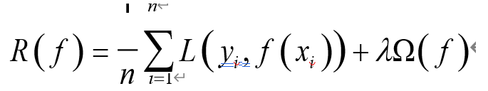

​		其中， *R* ( *f* ) 表示结构风险， *L* ( *yi* , *f* ( xi )) 表示第*i* 个样本的经验风险， Ω( *f* ) 是表征模型复杂度的正则项，λ是正则化参数。根据奥卡姆剃刀定律，“如无必要，勿增实体”，即认为相对简单的模型泛化能力更好。而模型泛化能力强、泛化误差小，即表示模型推广能力强， 通俗理解就是在训练集中训练得到的优秀模型能够很好的适用于实际测试数据，而不仅仅是减少训练误差或者测试误差。泛化误差定义如下：

**E = *Bias*^2 ( *X* ) + *Var* ( *X* ) + *Noise***

其中， *E* 表示泛化误差， *Bias* 代表偏差(经验风险)，*Var* 代表方差（模型复杂度）， *Noise* 代表噪声

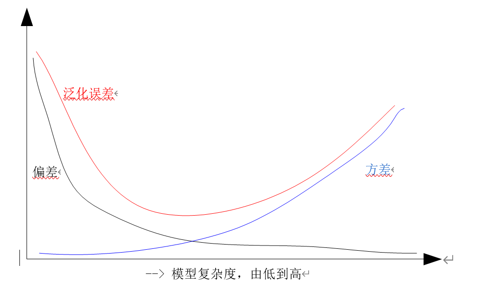

​		从上图可以看出，随着模型复杂度会增加，偏差减少，方差增大，而泛化误差呈现 U 型变化，对于一个“好的系统”通常要求误差小，正则化的作用即为适当的控制模型复杂度，从而使得泛化误差曲线取最小值。

### **1.2（公式）正则化等价于带约束的目标函数中的约束项**

以平方误差损失函数和 L2 范数为例，优化问题的数学模型如下：

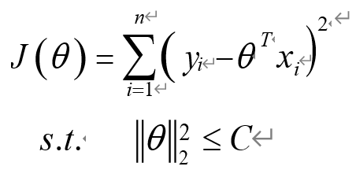

针对上述带约束条件的优化问题，采用拉格朗日乘积算子法可以转化为无约束优化问题，即

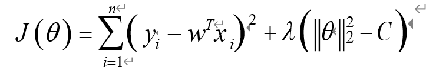

由于参数C 为常数，可以忽略，故上述公式和标准的正则化公式完全一致。

### **1.3 **从贝叶斯角度考虑，正则项等价于引入参数的模型先验概率，可以简单理解为对最大似然估计引入先验概率，从而转化为最大后验估计，其中的先验概率即正则项

这部分内容后面详细讲解。

## 2.机器学习正则化技术基本概念

​		正则化也可以称为规则化、权重衰减技术，不同的领域叫法不一样，数学上常称为范数， 例如 L1 和 L2 范数，统计学领域叫做惩罚项、罚因子。下面给出范数的数学公式：

（1）P 范数

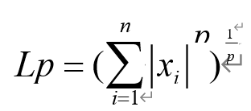

（2）L0 范数：0 范数表示向量中非零元素的个数（即为其稀疏度）

（3）L1 范数：即向量元素绝对值之和， *p* 范数取 1 则为 1 范数

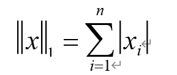

（4）L2 范数：即向量元素绝对值的平方和再开方，也称为欧几里得距离, *p* 范数取 2 则为L 2 范数

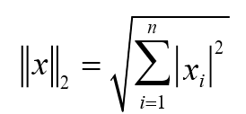

（5）正无穷 范数: 即所有向量元素绝对值中的最大值, *p* 范数取正无穷 则为正无穷 范数

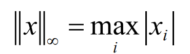

（6）  负无穷 范数：即所有向量元素绝对值中的最小值,  *p* 范数取负无穷 则为负无穷 范数

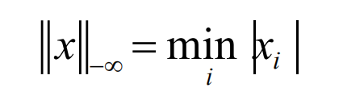

假设向量长度为 2 维，则有下列图形：

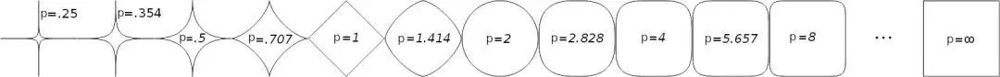

假设向量长度为3 维，则有下列图形：

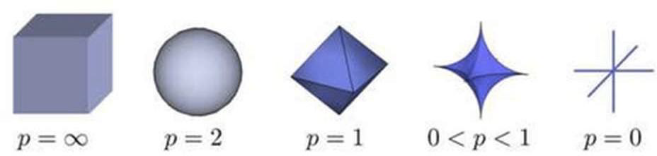

​		从上述各图可以看出： P 越小，曲线越贴近坐标轴， p 越大，曲线越远离坐标轴，并且棱角越明显，当p 取0 时候，是完全和坐标轴贴合，当p 取正无穷时候，呈现正方体形状。同时也可以看出，采用不同的范数作为正则项，会得到完全不同的算法模型结果，故而对于不同要求的模型，应该采用不同的范数作为正则项。

## 3.机器学习正则化技术的深度理解

为了更好的理解正则化技术原理，下面从4 个角度进行深度分析

### 3.1 简单数值假设分析法

此处以L2 范数讲解，下面的各图形来自吴恩达的机器学习课程。

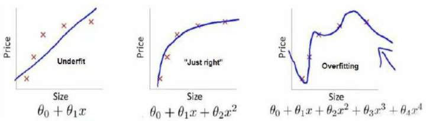

首先需要明确：左边的曲线拟合是欠拟合，中间的曲线拟合是刚好合适，右边的曲线拟合是过拟合。对于右边的拟合曲线，有

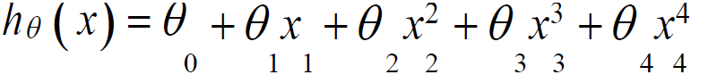

从上式可以看出，由于θ3 和θ4 对应了高阶，导致拟合曲线是4 阶曲线，出现了过拟合。正则化的目的为适当缩减θ3 和θ4 的值，例如都为0.0001，则上述曲线本质上等价于

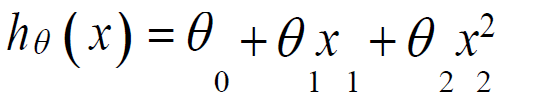

也就是变成了中间的刚好合适的拟合曲线。对θ3 和θ4 增加L2 正则项后的代价函数表达式为

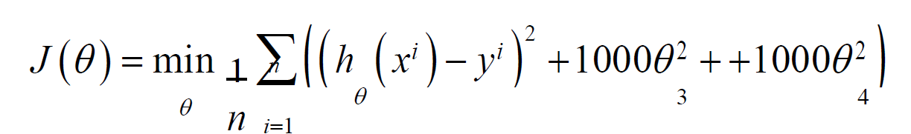

从上式可以看出，*θ*3 和θ4 均大于0，其乘上了1000，要是代价函数最小，则会迫使模型学习到的θ3 和θ4 会非常小，因为只有在θ3 和θ4 会非常小的情况下整个代价函数值才会取的较小值。在实际开发中，是对所有参数进行正则化，为了使代价函数尽可能的小，所有的参数θ的值（**不包括θ0** ）都会在一定程度上减小，但是减少程度会不一样，从而实现了权重衰减、简化模型复杂度的作用。

### 3.2 图形分析法

此处采用L1 和L2 范数讲解，
(1) **L2** **范数正则**

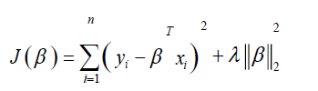

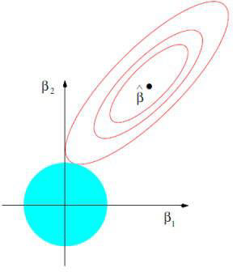

​		蓝色的圆形空间表示L2 范数空间，设为β1^2 +β2 ^2 = r^2 ，可以看出，当r 从0 逐渐增大时候，该圆形也逐渐增大，红色的线表示原始代价函数解空间。

​		设参数只有2 维。红色圆环上的任何一点都表示一个可行解即代表一组β1, β2 ，其中任何一个红色圆环上面的β1, β2 对应的代价函数值一样(可以简单理解为等值线)， βˆ 代表最佳解空间。由于初中数学知识可知，当正则项β1^2 * β2^2 = r^2 和原代价函数项这两个空间有交集时候，即代表了一个J (β) 的解，当不存在正则项时候， λ为0， **J （β）** 的解为原始代价函数的解，表示没有解空间，没有受到任何约束。通过样本集训练，不容易直接收敛到最优值βˆ ，并且出现过拟合，然而在增加了正则项后，随着不断增加r 取值，原始解空间会被不断压缩，如果选择的λ合适，则可以将最优点压缩到βˆ 处，从而得到合适的模型。

(**2**) **L1** **范数正则**

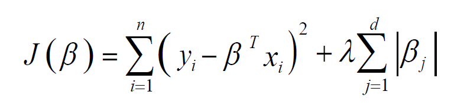

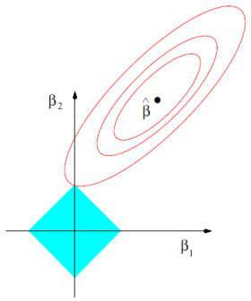

同上述L2 分析一致，L1 范数对应的解空间图形为菱形，作用和L2 一致。
需要注意：L2 范数与原代价函数的交点处所得到的参数β 可以无限缩小，但是一定不会为0，然而L1 范数与原代价函数的交点一般在坐标轴上，从而使得某些βi =0，得到稀疏解(当然，并没有绝对保证一定交于坐标轴，但是通过实验发现，大部分都可以得到稀疏解)。同时观察上一节的L0 范数的解空间图形发现：如果使用L0 范数正则，则可以保证一定得到稀疏解，但是由于L0 范数的实际求解是NP 问题（多项式复杂程度的非确定性问题），难以计算，故在实际应用中一般都是采用L1 范数代替L0 范数得到稀疏解，可以简单认为L1 范数是L0 范数的凸近似。

3.2小结：

不管是哪个正则化，以上面例子来讲，就是不管是L1还是L2，如果式子(代价函数，结构代价最小化)=0有解的话，那么肯定式子的两项会相交于空间中的一点，从而压缩了原始解空间，而由于不加正则项的原始最优解是达到经验风险最小化，所以并不是所谓的泛化误差最优解，所以我们通过正则项就可以将解压缩到泛化误差最优解

区别：L1范数可以导致稀疏解参数减为0，L2范数导致稠密解减小参数

### 3.3 公式推导分析法

此处采用损失函数为误差平方和、正则项为L1 和L2 范数的线性回归为例讲解。增加L2 正则项后其代价函数为：

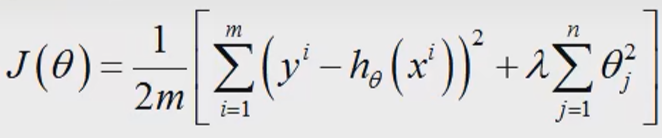

其中m为样本个数， n为特征个数，为了最小化代价函数，直接对各θj 进行求导然后等于0 即可求得估计值，可得：

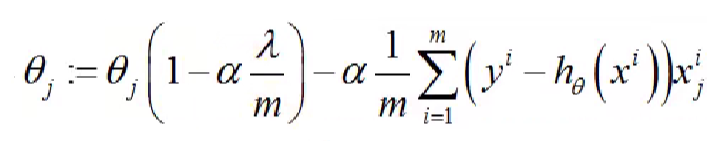

从上式可以看出：α 为步长，因为α非常小，0<1-αλ/m<1，很明显L2 范数的作用就是对每一个θj 进行了一定程度的缩减，但是一定不会缩减为0，从公式也可以看出L2 范数的作用。所以正则化也叫权重衰减

对于L1 正则项后其代价函数为：

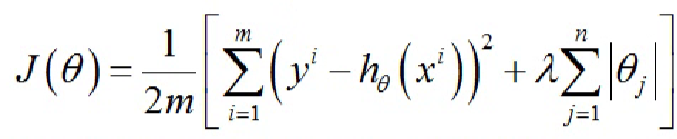

直接对各θj 进行求导即可求得估计值，可得：

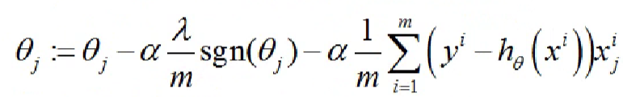

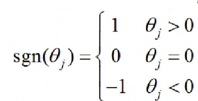

​		从上式可以看出：当上一轮θj 大于0 时，下一次更新θj 一定减少，当上一轮θj 小于0 时，下一次更新θj 一定增加，也就是说每一轮训练， θj 都是一定往0 方向靠近，最终可得近似的稀疏解，同样从公式也可以看出L1 范数的作用。

​		同时从上述公式可以看出，在|θj| <1情况下，由于L2 范数正则作用，每次θ j 都是减少(αλ/m )θ j，而L1 范数正则作用下，每次θ 都是减少(αλ/m)*sgn(θ ) ，很明显参数优化速度L1 快于L2。

### 3.4 贝叶斯推断分析法

​		以L1 和L2 范数为例，所得结论可以推广到P 范数中，首先需要知道：整个最优化问题从贝叶斯观点来看是一种贝叶斯最大后验估计，其中正则化项对应后验估计中的先验信息，损失函数对应后验估计中的似然函数，两者的乘积即对应贝叶斯最大后验估计的形式。
针对L1 和L2 范数还有结论：L2 范数相当于给模型参数θ设置一个协方差为1/alpha 的零均值高斯先验分布，L1 范数相当于给模型参数θ设置一个参数为1/alpha 的拉普拉斯先验分布。

为了讲清楚上述结论，需要前置知识点：(1) 高斯分布和拉普拉斯分布的定义和形状；(2) 贝叶斯定理；(3) 最大似然估计；(4) 最大后验估计。下面我对这4 个知识点进行解释。

(1) 高斯分布和拉普拉斯分布
a) 高斯分布的概率密度函数定义为：

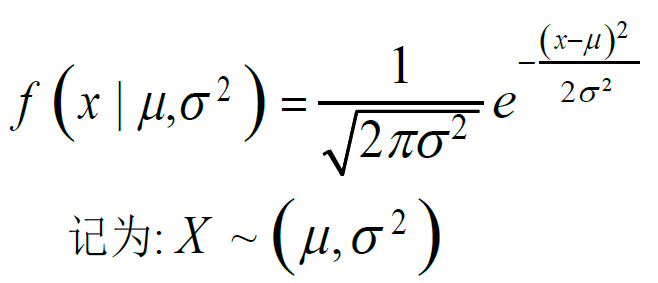

其中， μ 为数学期望，尺度参数σ 为标准差， x 为随机变量，其图形为：

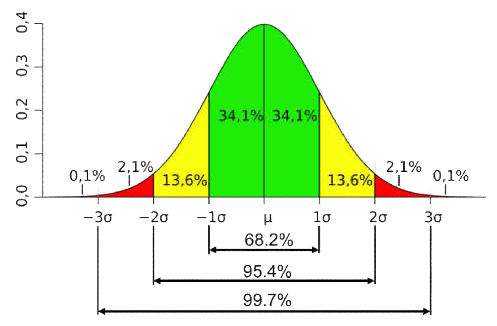

其中，  μ控制曲线的左右移动，σ 控制曲线的衰减快慢，σ 越大，曲线越平缓，衰减越慢。

b) 拉普拉斯分布的概率密度函数定义为：

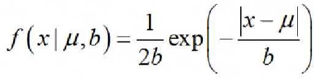

 μ 为数学期望， b 为尺度参数， x 为随机变量，其图形为：

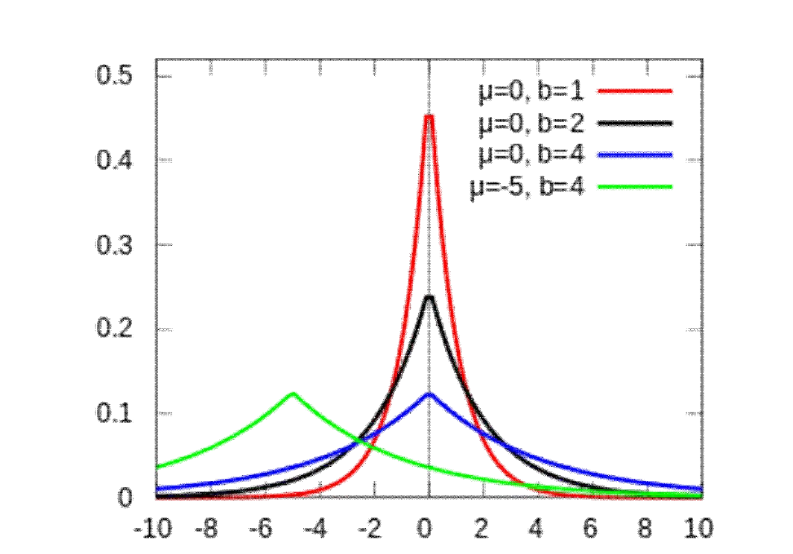

(2) **最大似然估计（经验风险最小化）**
		定义为：在已知试验结果（即是样本）的情况下，用来估计满足这些样本分布的参数，把可能性最大的那个参数θˆ作为真实θ 的参数估计。

​		通俗理解就是，该算法作用是找到一组参数θˆ来最大化复现或者拟合当前样本空间。可以发现如果样本空间不一样，则通过最大似然估计得到的θˆ也不一样，即最大似然估计永远都是基于当前样本，所以可以想象出很容易出现过拟合，即求得的参数θˆ 只是能很好的拟合当前样本，然而推广和泛化能力很弱，**即没有加正则项的损失函数**。若总体X 属于离散型，其分布律P （X = x）=  p （ x;θ ） ，θ 形式已知，是待估参数，设X1, 2 …… Xn 为来自总体X 的样本，其X1, X 2 …… Xn 的联合分布律为：

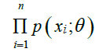

​		又设x1, x2 ,……xn 是来自X1, X2 ,…… Xn 对应的一个样本， 易知样本X1, X2 ,…… Xn 观察到x1, x2 ,…… xn 的概率，亦即事件（X1 = x1, X 2 = x2 ,…… Xn = xn）发生的概率为：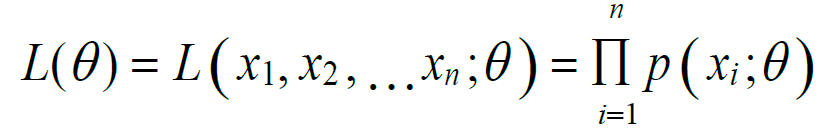

​		L(θ ) 为似然函数，最大化L(θ)所得到的参数θ 即为最大似然估计法。由于上述式子不好计算，而因为L(θ ) 和ln L(θ ) 在同一处取极值，故通常取对数即所谓的对数似然函数，其中最大似然函数如下所示：

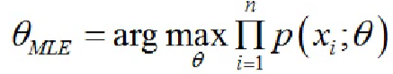

​		假设我要统计出整个大学内所有同学的身高分布情况，设全校一共20000 人，数量庞大，所有人都去问一遍不太靠谱，所以我打算采用抽样方法来估计，假设我已经知道身高分布服从高斯分布，但是我不知道高斯分布中的均值和方差参数，现在我打算采用最大似然估计方法来确定这两个参数。首先需要明确，全校20000 即为总体X，我随机从各个班抽取10 名同学，假设一共抽了2000 个同学，那么2000同学就构成了样本空间，则抽取的2000 个同学就构成了x1, x2 ,……x2000 ，由于每个样本的概率密度函数已知，则很容易写出似然函数，对数求导即可求解参数。

(3) **最大后验估计（正则化）**
		首先需要明确：**最大后验估计和最大似然估计联系非常密切，对最大似然估计引入先验概率估计即转化为最大后验估计，最大后验概率估计可以看作是规则化的最大似然估计。**最大似然估计属于频率派的观点，其认为参数θ 是一个固定不变的常量，只是我们现在还不知道它的值，可以通过随机产生的样本去估计这个参数。最大后验估计属于贝叶斯学派推导而来，其认为一切皆变量，服从某一个分布，认为参数θ 是一个未知的随机变量，我们可以给出参数θ 分布情况的先验概率，然后基于贝叶斯定理估计模型。根据贝叶斯公式可得，后验概率计算公式为：

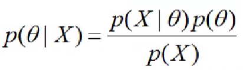

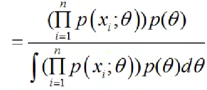

​		由于分母计算非常困难，而我们的目的是求最大化后验概率，故分母不进行计算(我们在朴素贝叶斯算法中也是这样处理的)，只考虑分子：

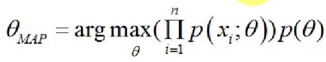

**最大后验估计就是在最大似然估计函数上面乘上了一项先验分布而已**。

下面开始解释：L2 范数相当于给模型参数θ 设置一个零均值高斯先验分布。以线性归模型为例，结论可以推广到任意模型，线性模型方程可以表示为

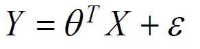

中， ε 表示误差，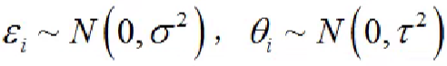

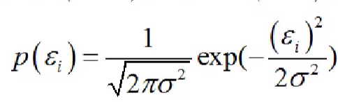

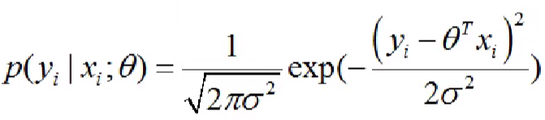

通过上式可知**最大化**（高斯分布图像实际值和高斯值接近，即希望exp括号内的值最小，即经验风险最小）后验估计方程形式，对其取对数：

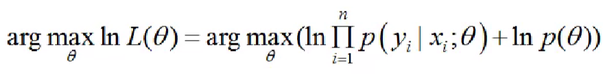

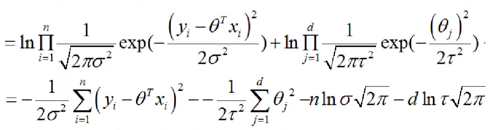

要求上式最大，去掉负号和统一处理前面的参数，故而可以转化为

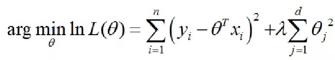

上式正好是线性回归问题在L2 范数正则下的代价函数，故验证了结论。

下面开始解释：L1 范数相当于给模型参数θ 设置一个拉普拉斯先验分布。以线性回归模型为例，结论可以推广到任意模型，

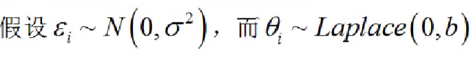

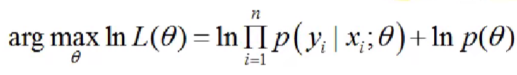

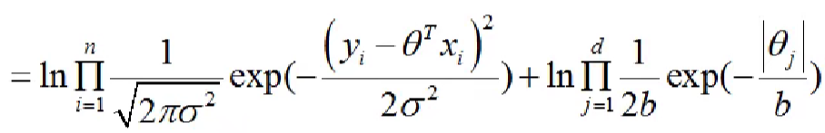

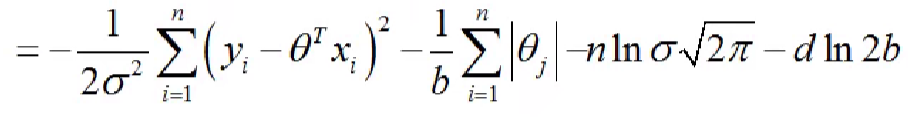

要求上式最大，去掉负号和统一处理前面的参数，故而可以转化为

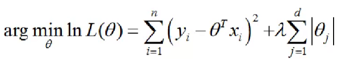

上式正好是线性回归问题在L1 范数正则下的代价函数，故验证了结论。

如果误差符合 0 均值的高斯分布，那么最大似然估计法的结果就是最小二乘法，这也是为何误差定义经常使用**平方误差公式**的原因，因为这个公式是基于概率推导出来的。

## 4.机器学习正则化技术的典型算法应用

### 4.1 逻辑回归

二分类逻辑回归使用Sigmoid 作为决策函数进行分类，该函数可以将任意的输入映射到[0,1]区间，当预测结果小于0.5，则表示负类，当预测结果大于0.5.则表示正类，其模型本质是求最大似然估计，具体求解似然函数通常使用梯度下降法，而前面说过：最大似然估计
法没有考虑训练集以外的因素，很容易造成过拟合，故而逻辑回归一般采用L2 范数进行正则化操作，Sigmoid 函数定义和图形如下：

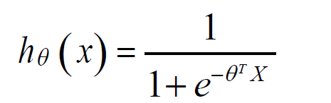

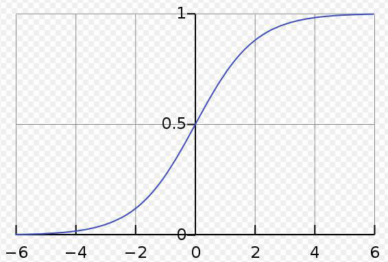

其中用最大似然函数估计的方法写出似然方程和对数似然方程为：

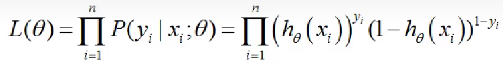

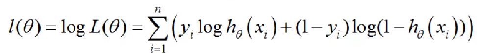

正则化后的代价函数为：

注意: 正则化是针对损失函数，而不是似然函数，故需要将似然函数取负号转换为损失函数，然后再加上正则项。

### 4.2 岭回归

​		岭回归本质上是针对线性回归问题引入了L2 范数正则，通过缩减回归系数避免过拟合问题，最先用来处理特征数多于样本数的情况(高维小样本问题)，现在也用于在估计中加人偏差，从而得到更好的估计，加了正则化后的代价函数如下：

​		其中， βˆ 表示估计的回归系数，n 表示样本个数，d 表示回归系数个数， yi 表示第i 个样本实际输出值， β j 表示第j 个回归系数， λ为正则化参数。当λ=0，表示不添加正则，则很容易导致原代价函数为0，预测值与实际值完全贴合即出现了所谓的过拟合问题，当λ过大，会导致βj 系数变小，但不会为0，减少了模型复杂度，原代价函数值较大，出现欠拟合。在实际开发中，通常使用交叉验证集多次循环迭代确定最佳λ值。

​		带正则化的代价函数采用最小二乘法或者正规方程可以得到上述回归系数结果，可以发现：经过L2 范数罚后，不仅仅压缩了系数，而且可以使得原先可能不可逆的矩阵一定可逆( X ^T *X + λI ）一定可逆，这也是L2 正则的好处之一。

### 4.3 Lasso 回归

​		拉索回归本质上是针对线性回归问题引入了L1 范数正则，通过缩减回归系数避免过拟合问题，其不同于L2 范数，其可以将某些系数缩减为0 即所谓的具备稀疏性(稀疏性的好处是简化计算、容易理解模型、减少存储空间、不容易出现过拟合等等)，加了正则化后的代价函数如下：

​		其中，L1 范数罚有一个问题：由于|x| 函数在0 处不可导，故而直接使用最小二乘法、梯度下降法等方法均失效，但是由于其为第一类间断点中的可去间断点，可以通过补充该点的定义解决.通常，对于线性回归中的lasso回归可以采用近似的前向逐步回归替代。

### 4.4 SVM

​		支持向量机SVM 优化目的为寻找一个超平面，使得正负样本能够以最大间隔分离开，从而得到更好的泛化性能，其通过引入核函数来将低维线性不可分的样本映射到高维空间从而线性可分，通过引入惩罚参数C(类似于正则化参数)来对错分样本进行惩罚，从而减少模型复杂度，提高泛化能力，其优化目标如下：

​		只需要关注后面正则项部分，惩罚参数C 作用和正则化参数***λ*** 作用一致，只是反相关而已。需要明白以下结论：
​		(1) C 越大， λ 越小，表示对分错样本的惩罚程度越大，正则化作用越小，偏差越小，方差越大，越容易出现过拟合(通俗理解，原本将低维空间映射到5 维空间正好线性可分，但是由于惩罚过于严重，任何一个样本分错了都不可原谅，结果系统只能不断提高维数来拟合样本，假设为10 维，最终导致映射维数过高，出现过拟合样本现象，数学上称为VC 维较大)；

​		(2) C 越小， λ 越大，表示对分错样本的惩罚程度越小，正则化作用越大，偏差越大，方差越小，越容易出现欠拟合(通俗理解，原本将低维空间映射到5 维空间正好线性可分，但是由于惩罚过小，分错了好多样本都可以理解，比较随意，结果系统也采用简化版来拟合样本，假设为3 维，最终导致映射维数过低，出现欠拟合样本现象，数学上称为VC 维较小)。

​		VC维反映了函数集的学习能力，VC维越大则学习机器越复杂（容量越大），遗憾的是，尚没有通用的关于任意函数集VC维计算的理论，只对一些特殊的函数集知道其VC维。例如在N维空间中线性分类器和线性实函数的VC维是N+1。VC维跟模型复杂度是正相关的。

## 5.正则化技术总结

重要结论：

**(1) 正则化的作用是防止过拟合、提高模型泛化能力**
**(2) 正则化等价于结构风险最小化**
**(3) 正则化等价于带约束的目标函数中的约束项**
**(4) 正则项等价于引入参数的模型先验概率**
**(5) 在误差符合均值为0 的高斯分布，则最大似然估计和最小二乘法等价**
**(6) 最大后验估计就是在最大似然估计函数上面乘上了一项先验分布而已**
**(7) L2 范数相当于给模型参数θ 设置一个零均值高斯先验分布，L1 范数相当于给模型参数θ 设置一个拉普拉斯先验分布**
**(8) L0 和L1 正则可以得到稀疏解，而L2 不能，并且参数优化速度L1 快于L2，但是L2 更容易理解，计算更方便。**

有一个需要注意的地方：正则化方法一般都是不对偏移项进行正则的，原因是它们也没有和数据直接有乘法等交互，其不会影响到最后结果中某个数据维度的作用，如果你执意要对其进行正则化，也是可以的，对结果没有多少影响。

前面讨论了，正则化是一种可以有效防止过拟合的方法，然而如何判断模型是否或者容易出现过拟合？常用的办法有：

**(1) 比较模型对验证集和训练集的识别精度，如果验证集识别精度大幅低于训练集，则可以判断模型存在过拟合；**

**(2) 训练集的代价函数快速下降至0附近，也可以怀疑出现了过拟合；**

**(3) 样本个数比特征个数少，也很容易出现过拟合。**

验证集的作用：https://blog.csdn.net/ytusdc/article/details/86488537

# 八、聚类

## 1.算法介绍

**聚类算法**：就是把距离作为特征，通过自下而上的迭代方式（距离对比），快速地把一群样本分成几个类别的过程。

**更严谨，专业一些的说法是：**

将相似的对象归到同一个簇中，使得同一个簇内的数据对象的**相似性尽可能大**，同时不在同一个簇中的数据对象的**差异性也尽可能地大**。即聚类后同一类的数据尽可能聚集到一起，不同数据尽量分离。

很显然，**聚类是一种无监督学习**

常见的聚类算法

聚类算法是根据样本之间的相似度，将数据进行归类的。而相似度的度量方法，可以大致分为：

- 距离相似性度量
- 密度相似性度量
- 连通相似性度量

不同类型的聚类算法，采用的样本间的相似度度量方法是不同的。这章讲的是基础：k—means算法

## 2.k—means

对于给定的样本集，按照样本之间的距离大小，将样本集划分为K个簇。让簇内的点尽量紧密的连在一起，而让簇间的距离尽量的大

## 3.K-Means 聚类的步骤如下：

1. 随机的选取K个中心点，代表K个类别；
2. 计算N个样本点和K个中心点之间的欧氏距离；
3. 将每个样本点划分到最近的（欧氏距离最小的）中心点类别中——迭代1；
4. 计算每个类别中样本点的均值，得到K个均值，将K个均值作为新的中心点——迭代2；
5. 重复步骤2、3、4；
6. 满足收敛条件后，得到收敛后的K个中心点（中心点不再变化）。

K-Means 聚类可以用欧式距离，欧式距离很简单，二维平面就是两个点的距离公式，在多维空间里，假设两个样本为a(x1,x2,x3,x4...xn)，b(y1,y2,y3,y4...yn)，那么他们之间的欧式距离的计算公式是：

## 4. 算法优化

### **4.1、初选质心优化K-Means++**

​    上面我们提到，k个初始化的质心的位置选择对最后的聚类结果和运行时间都有很大的影响，因此需要选择合适的k个质心。如果仅仅是完全随机的选择，有可能导致算法收敛很慢。**K-Means++算法就是对K-Means随机初始化质心的方法的优化**。

​		K-Means++的对于初始化质心的优化策略也很简单，如下：

​    	  a) 从输入的数据点集合中随机选择一个点作为第一个聚类中心μ1
　　  b) 对于数据集中的每一个点xi，计算它与已选择的聚类中心中**最近聚类中心**的距离: 

​                                              

​          当选第一个点最为聚类中心后，此时聚类中心只有一个，这时会计算所有点到这一个聚类中心的距离，第二个聚类中心点的选取有很大概率会倾向于选择中距离比较大的，不是一定就选取中最大的，因为这里涉及到了一个概率的问题，详细的过程这里我就不展开了，当选取了第二个聚类中心后，此时聚类中心有2个，这里也需要注意了，在计算距离的时候要取小，数学语言表达就是min（), 这里其实也很好理解，因为距离较近的话，很容易会被分到距离较近的簇中，更多的聚类中心与此类似。

​     	 c) 选择一个新的数据点作为新的聚类中心，选择的原则是：D(x)较大的点，被选取作为聚类中心的概率较大
　　  d) 重复b和c直到选择出k个聚类质心
　　  e) 利用这k个质心来作为初始化质心去运行标准的K-Means算法

https://blog.csdn.net/qq_42364307/article/details/111451367

### 4.2、**距离计算优化elkan K-Means**

​		在传统的K-Means算法中，我们在每轮迭代时，要计算所有的样本点到所有的质心的距离，这样会比较的耗时。那么，对于距离的计算有没有能够简化的地方呢？elkan K-Means算法就是从这块入手加以改进。它的**目标是减少不必要的距离的计算**。那么哪些距离不需要计算呢？

​		elkan K-Means利用了两边之和大于等于第三边,以及两边之差小于第三边的三角形性质，来减少距离的计算。

​	第一种规律是对于一个样本点x和两个质心j1,j2。如果我们预先计算出了这两个**质心之间的距离**D(j1,j2)，则如果计算发现2D(x,j1)≤D(j1,j2)我们立即就可以知道D(x,j1)≤D(x,j2)。此时我们不需要再计算D(x,j2),也就是说省了一步距离计算。

​		第二种规律是对于一个样本点x和两个质心j1,j2。我们可以得到D(x,j2)≥max{0,D(x,j1)−D(j1,j2)}。这个从三角形的性质也很容易得到。

​		利用上边的两个规律，elkan K-Means比起传统的K-Means迭代速度有很大的提高。但是如果我们的**样本的特征是稀疏的，有缺失值的话，这个方法就不使用了，此时某些距离无法计算，则不能使用该算法。**

### 4.3、**大样本优化Mini Batch K-Means**

​		在传统的K-Means算法中，要计算所有的样本点到所有的质心的距离。如果样本量非常大，比如达到10万以上，特征有100以上，此时用传统的K-Means算法非常的耗时，就算加上elkan K-Means优化也依旧。在大数据时代，这样的场景越来越多。此时Mini Batch K-Means应运而生。

　　顾名思义，Mini Batch，也就是**用样本集中的一部分的样本**来做传统的K-Means，这样可以避免样本量太大时的计算难题，算法收敛速度大大加快。当然**此时的代价就是我们的聚类的精确度也会有一些降低**。一般来说这个降低的幅度在可以接受的范围之内。

　　在Mini Batch K-Means中，我们会选择一个**合适的批样本大小batch size**，我们仅仅用batch size个样本来做K-Means聚类。那么这batch size个样本怎么来的？一般是**通过无放回的随机采样得到**的。

　　为了增加**算法的准确性，我们一般会多跑几次Mini Batch K-Means算法**，用得到不同的随机采样集来得到聚类簇，选择其中最优的聚类簇。

## 5.与knn的区别：

​		K-Means是无监督学习的聚类算法，没有样本输出；而KNN是监督学习的分类算法，有对应的类别输出。KNN基本不需要训练，对测试集里面的点，只需要找到在训练集中最近的k个点，用这最近的k个点的类别来决定测试点的类别。而K-Means则有明显的训练过程，找到k个类别的最佳质心，从而决定样本的簇类别。两者也有一些相似点，两个算法都包含一个过程，即找出和某一个点最近的点。两者都利用了最近邻(nearest neighbors)的思想。

## 6.sklearn.cluster.k-means

KMeans类的主要参数有：

- **n_clusters**: 即我们的k值，一般需要多试一些值以获得较好的聚类效果。k值好坏的评估标准在下面会讲。
- **max_iter**： 最大的迭代次数，一般如果是凸数据集的话可以不管这个值，如果数据集不是凸的，可能很难收敛，此时可以指定最大的迭代次数让算法可以及时退出循环。
- **n_init：**用不同的初始化质心运行算法的次数。由于K-Means是结果受初始值影响的局部最优的迭代算法，因此需要多跑几次以选择一个较好的聚类效果，默认是10，一般不需要改。如果你的k值较大，则可以适当增大这个值。
- **init：** 即初始值选择的方式，可以为完全随机选择'random',优化过的'k-means++'或者自己指定初始化的k个质心。一般建议使用默认的'k-means++'。
- **algorithm**：有“auto”, “full” or “elkan”三种选择。"full"就是我们传统的K-Means算法， “elkan”是elkan K-Means算法。默认的"auto"则会根据数据值是否是稀疏的，来决定如何选择"full"和“elkan”。一般数据是稠密的，那么就是 “elkan”，否则就是"full"。一般来说建议直接用默认的"auto"

## 总结

K-Means 聚类是最简单、经典的聚类算法，因为聚类中心个数，即 K 是需要提前设置好的，所以能使用的场景也比较局限。

比如可以使用 K-Means 聚类算法，对一张简单的表情包图片，进行前后背景的分割，对一张文本图片，进行文字的前景提取等。

K-Means 聚类能使用的距离度量方法不仅仅是欧式距离，也可以使用曼哈顿距离、马氏距离，思想都是一样，只是使用的度量公式不同而已。

